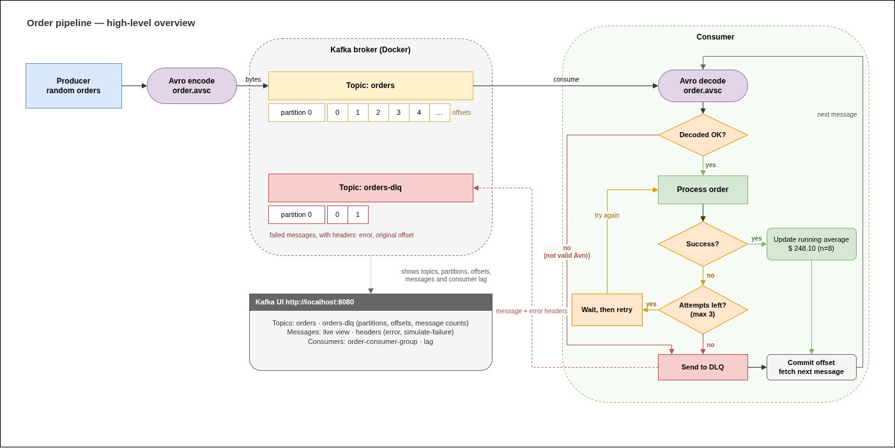

# Kafka Order Pipeline

A Kafka producer and consumer for **order messages**, built for the Big Data
assignment. Every message is **Avro-serialized**. The consumer keeps a
**real-time running average** of prices, **retries** temporary failures, and
routes **permanently failed** messages to a **Dead Letter Queue**.

## Architecture



- The **producer** creates a random order `{orderId, product, price}`,
  Avro-encodes it with `schemas/order.avsc`, and sends it to the `orders`
  topic.
- The **consumer** reads from `orders` and decodes each message with the same
  schema.
  - Can't be decoded → straight to the DLQ (retrying can't fix bad bytes).
  - Processed successfully → the **running average** is recalculated.
  - Processing failed → retry, up to 3 attempts in total.
  - Still failing after the last attempt → the message is sent to the
    `orders-dlq` topic with headers saying why.
  - Either way, the offset is committed and the next message is fetched.
- **Kafka UI** shows the topics, partitions, offsets, messages (live) and
  the consumer group's lag.

## Technologies used

| Technology | Used for |
|---|---|
| **Python 3.12** | producer, consumer and DLQ reader |
| **Apache Kafka 4.3.1** (KRaft mode) | the broker — no Zookeeper needed |
| **Docker Compose** | runs the broker, creates the topics, runs the dashboard |
| **confluent-kafka 2.15.0** | Kafka client library for Python |
| **fastavro 1.12.2** | Avro encoding/decoding directly against `order.avsc` (schemaless — no schema registry) |
| **rich 15.0.0** | colored terminal output and the summary tables |
| **pytest 9.1.1** | unit tests and one end-to-end test |
| **Provectus Kafka UI v0.7.2** | web dashboard at http://localhost:8080 |
| **GNU Make** | short commands for every task (`make up`, `make consumer`, …) |

## Key concepts

| Term | Meaning in this project |
|---|---|
| Topic | Named channel for messages — `orders` and `orders-dlq` |
| Partition | A topic is split into partitions; here 1 partition per topic |
| Offset | Position of a message inside a partition: 0, 1, 2, … |
| Consumer group | `order-consumer-group` — Kafka stores its offset, so a restarted consumer continues where it stopped |
| Avro | Binary format for the message value; producer and consumer share `schemas/order.avsc` |
| Running average | Average price of all successfully processed orders, recalculated after every message |
| Retry | On a temporary failure: wait `--retry-delay`, try again, up to `--max-attempts` |
| Dead Letter Queue | `orders-dlq` — where permanently failed messages are parked with error headers |

The order schema (`schemas/order.avsc`) is exactly what the assignment
specifies:

| Field | Type | Example |
|---|---|---|
| `orderId` | string | `"1001"` |
| `product` | string | `"Item1"` |
| `price` | float | `242.32` |

## Prerequisites

- Docker + the Docker Compose plugin
- Python 3
- GNU Make (optional — the raw command is shown under every `make` target)

## Setup

1. **Python environment**

   ```bash
   make venv      # python3 -m venv .venv && .venv/bin/pip install -r requirements.txt
   ```

2. **Start Kafka and the dashboard**

   ```bash
   make up        # docker compose -f docker/docker-compose.yml up -d
   make ps        # container status
   ```

   Three containers start: the **Kafka broker**, a one-shot **kafka-init**
   that creates the `orders` and `orders-dlq` topics and then exits (it shows
   as `Exited (0)` — that is success), and **Kafka UI**.

   The broker listens on `localhost:9092`; the dashboard is at
   **http://localhost:8080** (ready ~30 s after the broker). In the dashboard
   the message *value* appears as binary — that is the Avro encoding, and
   there is no schema registry for the dashboard to decode it with. Keys,
   headers, offsets and consumer lag are all readable.

## Running it

| Command | Raw equivalent | Does |
|---|---|---|
| `make consumer` | `.venv/bin/python -m src.consumer` | start the consumer (leave it running) |
| `make producer ARGS="…"` | `.venv/bin/python -m src.producer …` | send orders |
| `make dlq` | `.venv/bin/python -m src.dlq_reader` | print the Dead Letter Queue as a table |

**Producer flags**

| Flag | Default | Meaning |
|---|---|---|
| `--count` | run forever | how many orders to send |
| `--interval` | `1.0` | seconds between orders |
| `--scenario` | `normal` | `normal`, `transient`, `permanent` or `mixed` — see below |
| `--poison` | off | send one message that is **not** valid Avro, then exit |
| `--start-id` | `1001` | first `orderId` to use |

**Consumer flags**

| Flag | Default | Meaning |
|---|---|---|
| `--max-attempts` | `3` | processing attempts before a message is treated as permanently failed |
| `--retry-delay` | `1.0` | seconds to wait between attempts |

Stop either program with `Ctrl+C`. The consumer then prints a summary:
orders processed, how many recovered after a retry, how many went to the
DLQ, and the final running average.

## The four scenarios

Nothing in this pipeline fails on its own, so the **producer** can tag an
order with a `simulate-failure` header asking the consumer to simulate a
temporary or a permanent failure. The order data itself is never changed —
the Avro payload always has exactly the three fields above.

Start the consumer once (`make consumer`) and leave it running; each
scenario below is a single producer command in a second terminal.

| # | Scenario | Command | Consumer prints | Running average | DLQ | Demonstrates |
|---|---|---|---|---|---|---|
| 1 | Normal | `make producer ARGS="--count 5"` | green `RECEIVED` | updated ×5 | — | real-time aggregation |
| 2 | Temporary failure | `make producer ARGS="--count 3 --scenario transient --start-id 2001"` | yellow `RETRY` → bold green `RECOVERED` → `RECEIVED` | updated ×3 | — | retry logic |
| 3 | Permanent failure | `make producer ARGS="--count 2 --scenario permanent --start-id 3001"` | `RETRY`, `RETRY`, red `FAILED`, red `DLQ` | unchanged | +2 | Dead Letter Queue |
| 4 | Poison message | `make producer ARGS="--poison"` | red `DLQ`, no retries | unchanged | +1 | DLQ for undecodable data |

### 1. Normal orders — running average

```bash
make producer ARGS="--count 5"
```

```
RECEIVED  #1001 Item4  $ 242.32  avg $ 242.32 (n=1)  [p0 @0]
RECEIVED  #1002 Item2  $ 238.69  avg $ 240.51 (n=2)  [p0 @1]
RECEIVED  #1003 Item1  $  71.77  avg $ 184.26 (n=3)  [p0 @2]
```

Each order is decoded from Avro and the average price is recalculated after
every single message — `n` is how many orders are included so far. The
offsets (`@0`, `@1`, `@2`) show the position of each message in partition 0.

### 2. Temporary failure — retried, then recovers

```bash
make producer ARGS="--count 3 --scenario transient --start-id 2001"
```

```
RETRY     #2001 attempt 1/3 failed: simulated downstream timeout (transient) - retrying in 1.0s
RECOVERED #2001 succeeded on attempt 2
RECEIVED  #2001 Item5  $ 299.20  avg $ 215.24 (n=6)  [p0 @5]
```

The first attempt failed — like a service timing out. The consumer waited
and tried again, and the second attempt succeeded, so the order is still
counted in the running average. Nothing goes to the DLQ.

### 3. Permanent failure — Dead Letter Queue

```bash
make producer ARGS="--count 2 --scenario permanent --start-id 3001"
```

```
RETRY     #3001 attempt 1/3 failed: simulated validation error (permanent) - retrying in 1.0s
RETRY     #3001 attempt 2/3 failed: simulated validation error (permanent) - retrying in 1.0s
FAILED    #3001 attempt 3/3 failed: simulated validation error (permanent) - giving up
DLQ       #3001 -> orders-dlq [p0 @0]
```

Every attempt failed, so after the third one the consumer stops retrying and
sends the message to `orders-dlq` — keeping the original Avro bytes and
adding headers `error`, `original-topic`, `original-partition` and
`original-offset`. The running average does **not** change, and the consumer
carries on with the next message instead of crashing.

Inspect the queue:

```bash
make dlq
```

### 4. Poison message — straight to the DLQ

```bash
make producer ARGS="--poison"
```

```
DLQ       #poison -> orders-dlq [p0 @2]
```

This message is not valid Avro at all, so it cannot even be decoded. No
retry can fix bad bytes, so it goes straight to the DLQ with the reason
`decode error: …` — and again the consumer keeps running. (Any client can
write to a Kafka topic, so a consumer must survive data it cannot read.)

### All of them at once

```bash
make producer ARGS="--count 10 --scenario mixed --start-id 4001"
```

Sends a repeating mix — normal, normal, transient, normal, permanent — so
all the behaviours appear interleaved in one stream.

## Terminal colours

| Colour | Line | Meaning |
|---|---|---|
| green | `SENT` / `RECEIVED` | order sent / processed, average updated |
| yellow | `RETRY` | an attempt failed, waiting and trying again |
| bold green | `RECOVERED` | succeeded after one or more retries |
| bold red | `FAILED` / `DLQ` | last attempt failed / routed to the DLQ |
| cyan | banner, summary | configuration at start, totals at the end |

Colours switch off automatically when the output is redirected to a file.

## Tests

```bash
make test-unit         # 13 tests, no Kafka needed (~0.1 s)
make test-integration  # 1 end-to-end test against the broker (needs `make up`)
make test              # both
```

- **`tests/test_codec.py`** — the schema matches the assignment; Avro
  encode → decode round-trip; garbage is rejected.
- **`tests/test_processing.py`** — the running average (10, 20, 30 → 10, 15,
  20); a transient failure recovers on the second attempt; a permanent
  failure gives up after `--max-attempts`.
- **`tests/test_integration.py`** — produces normal, transient, permanent
  and poison messages to its own temporary topics, runs the consumer, and
  checks both the statistics and the DLQ contents. It skips itself if the
  broker isn't running, and deletes its temporary topics afterwards.

## Project structure

```
kafka-assessment-2/
├── README.md                          this file
├── Makefile                           short commands for everything
├── requirements.txt                   pinned Python dependencies
├── pytest.ini                         test configuration
├── .gitignore                         .venv/, __pycache__/, .pytest_cache/
├── diagrams/
│   ├── high-level-architecture.drawio editable diagram source
│   └── high-level-architecture.png    the diagram shown above
├── docker/
│   ├── docker-compose.yml             Kafka broker (KRaft) + topic init + Kafka UI
│   └── create-topics.sh               creates orders and orders-dlq on startup
├── schemas/
│   └── order.avsc                     Avro schema for order messages
├── src/
│   ├── config.py                      topics, group id, retry settings, schema path
│   ├── avro_codec.py                  Avro encode / decode
│   ├── processing.py                  running average + retry logic (pure Python)
│   ├── dlq.py                         send to / read from the Dead Letter Queue
│   ├── console.py                     colored terminal output
│   ├── producer.py                    order producer
│   ├── consumer.py                    order consumer
│   └── dlq_reader.py                  prints the DLQ contents
├── tests/
│   ├── test_codec.py                  schema + Avro round-trip
│   ├── test_processing.py             running average + retry logic
│   └── test_integration.py            end-to-end test against the broker
└── docs/
    └── Assignement Chapter 3.pdf      the original assignment brief
```

## Stopping / starting over

```bash
make down     # stop the containers, keep the topic data
make reset    # stop, wipe the topic data, start again (fresh offsets, empty DLQ)
```
