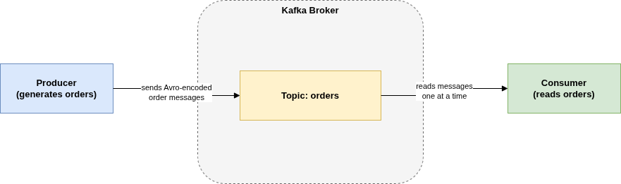
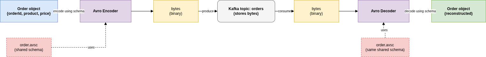
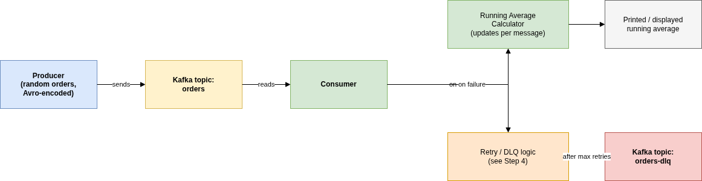
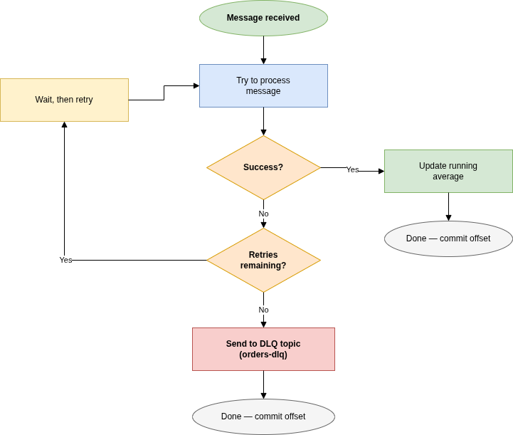

# Assignment, Explained Step by Step

This walks through the assignment (see `Assignment.md` for the raw text) in
plain language, one concept at a time. Each step has a diagram image, plus a
link to the editable `.drawio` source in the `diagrams/` folder — open those
in VS Code (it already has the Draw.io Integration extension) or at
[app.diagrams.net](https://app.diagrams.net).

The goal, in one sentence: **build two small programs — a producer and a
consumer — that pass "order" messages through Kafka, safely, with retries and
a fallback for messages that never succeed.**

---

## Step 1: What is Kafka?

Kafka is a messaging system. Think of it like a post office with numbered
mailboxes:

- A **producer** is a program that writes messages into a mailbox, called a
  **topic**.
- A **consumer** is a program that reads messages out of that mailbox, usually
  as soon as they arrive.
- The **broker** (Kafka itself) just stores and delivers messages reliably —
  it doesn't know or care what's inside them.

Diagram source: [`diagrams/01-kafka-basics.drawio`](diagrams/01-kafka-basics.drawio)

For this assignment, the "messages" are **orders**: a purchase with an ID, a
product name, and a price. You'll build one producer and one consumer.

---

## Step 2: The order message & Avro

Kafka only stores raw bytes — it has no idea what "an order" is. **Avro** is a
data format (similar in spirit to JSON, but compact and strict) used to turn
your order object into bytes before sending, and back into an object after
receiving.

The assignment defines the exact shape to use, in a schema file `order.avsc`:

| Field     | Type   | Description                                      |
|-----------|--------|---------------------------------------------------|
| `orderId` | string | Unique identifier for the order (e.g., `"1001"`)  |
| `product` | string | Name of the purchased item (e.g., `"Item1"`)      |
| `price`   | float  | Price of the product (randomized)                 |

**Both the producer and the consumer must use this same schema file** — that's
how they agree on what the bytes mean.

Diagram source: [`diagrams/02-avro-serialization.drawio`](diagrams/02-avro-serialization.drawio)

---

## Step 3: The full system you're building

Putting the producer, the topic, and the consumer together, with the two
extra behaviors the assignment asks for: a **running average** of prices, and
a **retry / DLQ** path for messages that fail to process.

Diagram source: [`diagrams/03-system-architecture.drawio`](diagrams/03-system-architecture.drawio)

- Every time an order is successfully processed, the consumer recalculates the
  **running average price** (e.g., orders priced 10, 20, 30 print averages
  10, 15, 20) — proving it's processing live, not just batch-reading everything
  at the end.
- If something goes wrong processing a message, it goes down the retry path
  instead of crashing the consumer.

---

## Step 4: Retry logic & Dead Letter Queue

Some failures are **temporary** (a brief network blip, a service that's
momentarily down) — those deserve a retry. If a message keeps failing even
after retries, it's treated as **permanently failed** and moved to a separate
"dead letter" topic instead of blocking everything else or getting silently
dropped.

Diagram source: [`diagrams/04-retry-dlq-flow.drawio`](diagrams/04-retry-dlq-flow.drawio)

For your live demo, this is the part worth showing on purpose: process a
batch of good messages, then intentionally trigger a failure and show it
retrying, then permanently failing and landing in `orders-dlq`.

---

## Step 5: What "done" looks like

The assignment asks for:

1. **Working code**: a producer + consumer, using Avro, with the running
   average, retry logic, and DLQ — in any programming language you choose.
2. A **Git repository** tracking your work as you build it (commit as you go,
   not one big dump at the end).
3. A **live demo** showing orders flowing through, the average updating, and
   a message failing its way into the DLQ.

A reasonable build order:

1. Get Kafka running locally (e.g., Docker Compose) — usually the first real
   hurdle.
2. Minimal producer that sends Avro-encoded messages to `orders`.
3. Minimal consumer that reads and prints them.
4. Add the running average.
5. Add retry logic (simulate a failure on purpose to test it).
6. Add the `orders-dlq` topic and the logic to push permanently-failed
   messages there.
7. Make it easy to demonstrate: deterministic failure scenarios the producer
   can request (`--scenario transient|permanent|mixed`), colored output,
   and a test suite that checks each requirement (see the README).
